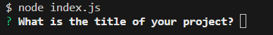
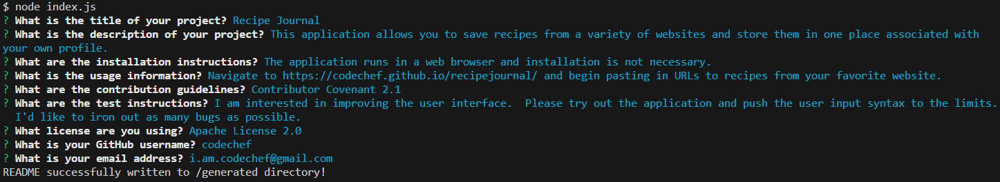
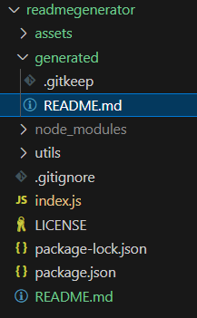

# README Generator 

## Description

This application saves a developer valuable time when working on a project by generating the markdown syntax for a professional README file.  The file is created after a developer answers a series of questions.  

- This project helped me further develop my skills using API requests and asynchronous JavaScript. 
- I was able to demonstrate my understanding of arrow functions, template literals, and array destructuring.   
- The list of licenses is retrieved from GitHub's API and will stay up to date with common licenses.  
- Improving my focus on the DRY principle of coding was a large focus for this project.

## Table of Contents

- [Installation](#installation)
- [Usage](#usage)
- [License](#license)
- [Questions](#questions)

## Installation

This application requires Node.js and Inquirer to be installed.  With Node.js installed, clone the GitHub repository, then install Inquirer in the project directory by running the following code in the terminal: npm i inquirer@8.2.4

## Usage

The code repository can be accessed here:
https://github.com/briandwach/readme-generator

There is an example README file in the ./assets/example directory.  

This application is ran in a terminal with Node.js installed.  When in the root directory of the project, run the following code in the terminal: node index.js

  

The application will then present a series of questions.

  

Once they are all answered then a README file will be written in the ./generated directory. 

  

## License
This application is covered under the following license: MIT License 

## Questions
Please email me with any questions regarding this application at: 
brian.d.wach@gmail.com

Additionally, checkout more of my work on GitHub:
[briandwach](https://github.com/briandwach)